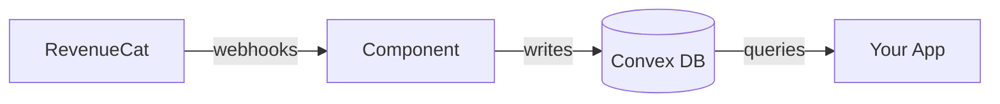

<p align="center">
  
  &nbsp;&nbsp;&nbsp;&nbsp;&nbsp;
  
</p>

<h1 align="center">Convex RevenueCat</h1>

<p align="center">
  <a href="https://www.npmjs.com/package/convex-revenuecat"></a>
  <a href="https://github.com/ramonclaudio/convex-revenuecat/actions"></a>
  <a href="LICENSE"></a>
</p>

<p align="center">
  A <a href="https://convex.dev">Convex</a> component for webhook-driven <a href="https://www.revenuecat.com">RevenueCat</a> subscription state.<br>
  Stores entitlements in your database for reactive, real-time access control.
</p>

## What This Component Does

This component **receives RevenueCat webhooks** and maintains subscription state in your Convex database. Use it to:

- Check if users have active entitlements (e.g., "premium" access)
- Query subscription status with Convex's real-time reactivity



> [!NOTE]
> This is not a replacement for the [RevenueCat SDK](https://www.revenuecat.com/docs/getting-started/installation). Use their SDK in your client app for purchases. This component handles the **server-side state** that webhooks provide.

## Features

- **Webhook Processing** — Idempotent handling of all 18 RevenueCat webhook events
- **Reactive Queries** — Real-time entitlement and subscription state in Convex
- **Correct Edge Cases** — Cancellation keeps access until expiration, pause doesn't revoke, etc.
- **Rate Limiting** — Built-in protection against webhook abuse (100 req/min per app)
- **Subscriber Attributes** — Stores customer attributes from webhooks
- **Experiment Tracking** — Tracks A/B test enrollments
- **Type-Safe** — Full TypeScript support

## Prerequisites

- [Convex](https://convex.dev) project (v1.31.6 or later)
- [RevenueCat](https://www.revenuecat.com) account with webhook access

## Installation

```bash
npm install convex-revenuecat
```

## Quick Start

### 1. Configure the Component

```typescript
// convex/convex.config.ts
import { defineApp } from "convex/server";
import revenuecat from "convex-revenuecat/convex.config";

const app = defineApp();
app.use(revenuecat);

export default app;
```

### 2. Mount the Webhook Handler

```typescript
// convex/http.ts
import { httpRouter } from "convex/server";
import { RevenueCat } from "convex-revenuecat";
import { components } from "./_generated/api";

const http = httpRouter();

const revenuecat = new RevenueCat(components.revenuecat, {
  REVENUECAT_WEBHOOK_AUTH: process.env.REVENUECAT_WEBHOOK_AUTH,
});

http.route({
  path: "/webhooks/revenuecat",
  method: "POST",
  handler: revenuecat.httpHandler(),
});

export default http;
```

### 3. Set Up Environment Variables

Generate a secure random string for webhook authorization:

```bash
openssl rand -base64 32
```

Add it to your Convex deployment:

```bash
npx convex env set REVENUECAT_WEBHOOK_AUTH "your-generated-secret"
```

> [!TIP]
> For local development, add to your `.env.local` file instead.

### 4. Configure RevenueCat Webhooks

1. Open the [RevenueCat Dashboard](https://app.revenuecat.com)
2. Select your project
3. Go to **Project Settings** → **Integrations** → **Webhooks**
4. Click **+ New**
5. Configure the webhook:

| Field | Value |
|:------|:------|
| Name | `Convex` (or any identifier) |
| Webhook URL | `https://<your-deployment>.convex.site/webhooks/revenuecat` |
| Authorization header | The secret you generated in step 3 |

6. Click **Save**

> [!NOTE]
> Find your Convex deployment URL in the [Convex Dashboard](https://dashboard.convex.dev) under your project's **Settings** → **URL & Deploy Key**.

### 5. Test the Webhook

1. In RevenueCat, go to your webhook configuration
2. Click **Send Test Event**
3. Verify the event was received:

```bash
npx convex logs
```

You should see a log entry showing the `TEST` event was processed.

> [!TIP]
> If the test fails, check [Troubleshooting](#troubleshooting) below.

## Usage

### Check Entitlements

```typescript
import { query } from "./_generated/server";
import { components } from "./_generated/api";
import { RevenueCat } from "convex-revenuecat";
import { v } from "convex/values";

const revenuecat = new RevenueCat(components.revenuecat);

export const checkPremium = query({
  args: { appUserId: v.string() },
  returns: v.boolean(),
  handler: async (ctx, args) => {
    return await revenuecat.hasEntitlement(ctx, {
      appUserId: args.appUserId,
      entitlementId: "premium",
    });
  },
});
```

### Get Active Subscriptions

```typescript
export const getSubscriptions = query({
  args: { appUserId: v.string() },
  handler: async (ctx, args) => {
    return await revenuecat.getActiveSubscriptions(ctx, {
      appUserId: args.appUserId,
    });
  },
});
```

## API Reference

### Constructor

```typescript
const revenuecat = new RevenueCat(components.revenuecat, {
  REVENUECAT_WEBHOOK_AUTH?: string, // Webhook authorization header
});
```

### Query Methods

| Method | Description |
|:-------|:------------|
| `hasEntitlement(ctx, { appUserId, entitlementId })` | Check if user has active entitlement |
| `getActiveEntitlements(ctx, { appUserId })` | Get all active entitlements |
| `getAllEntitlements(ctx, { appUserId })` | Get all entitlements (active and inactive) |
| `getActiveSubscriptions(ctx, { appUserId })` | Get all active subscriptions |
| `getAllSubscriptions(ctx, { appUserId })` | Get all subscriptions |
| `getCustomer(ctx, { appUserId })` | Get customer record |
| `getExperiment(ctx, { appUserId, experimentId })` | Get user's variant for a specific experiment |
| `getExperiments(ctx, { appUserId })` | Get all experiments user is enrolled in |

> [!NOTE]
> This component is a **read-only sync layer**. To grant promotional entitlements, use the [RevenueCat API](https://www.revenuecat.com/docs/api-v1) directly — the webhook will sync the state automatically.

## Webhook Events

<details>
<summary><strong>View all 18 supported webhook events</strong></summary>

| Event | Behavior |
|:------|:---------|
| `INITIAL_PURCHASE` | Creates subscription, grants entitlements |
| `RENEWAL` | Extends entitlement expiration |
| `CANCELLATION` | **Keeps** entitlements until expiration |
| `EXPIRATION` | **Revokes** entitlements |
| `BILLING_ISSUE` | Keeps entitlements during grace period |
| `SUBSCRIPTION_PAUSED` | **Does not** revoke entitlements |
| `SUBSCRIPTION_EXTENDED` | Extends expiration (customer support) |
| `TRANSFER` | Moves entitlements between users |
| `UNCANCELLATION` | Clears cancellation status |
| `PRODUCT_CHANGE` | Updates subscription product |
| `NON_RENEWING_PURCHASE` | Grants entitlements for one-time purchase |
| `TEMPORARY_ENTITLEMENT_GRANT` | Grants temp access during store outage |
| `REFUND_REVERSED` | Restores entitlements after refund undone |
| `TEST` | Dashboard test event (logged only) |
| `INVOICE_ISSUANCE` | Web Billing invoice created |
| `VIRTUAL_CURRENCY_TRANSACTION` | Virtual currency adjustment |
| `EXPERIMENT_ENROLLMENT` | A/B test enrollment (tracked) |
| `SUBSCRIBER_ALIAS` | User alias created (deprecated) |

</details>

> [!IMPORTANT]
> `CANCELLATION` does **not** revoke entitlements — users keep access until `EXPIRATION`.

## Database Schema

The component creates six tables:

| Table | Purpose |
|:------|:--------|
| `customers` | User identity, aliases, and subscriber attributes |
| `subscriptions` | Purchase records with product and payment details |
| `entitlements` | Access control state (active/inactive, expiration) |
| `experiments` | A/B test enrollments from RevenueCat experiments |
| `webhookEvents` | Event log for idempotency and debugging (30-day retention) |
| `rateLimits` | Webhook endpoint rate limiting (100 req/min per app) |

## Limitations

- **No initial sync** — Existing subscribers before webhook setup won't appear until they trigger a new event (renewal, cancellation, etc.)
- **Webhook-driven only** — Data comes exclusively from webhooks; no API polling or backfill mechanism
- **Raw payload storage** — Webhook payloads are stored as-is for debugging. These may contain subscriber attributes or other data you've configured in RevenueCat. Events are auto-deleted after 30 days.

## Testing

Register the component in your tests:

```typescript
import { convexTest } from "convex-test";
import revenuecatTest from "convex-revenuecat/test";

function initConvexTest() {
  const t = convexTest();
  revenuecatTest.register(t);
  return t;
}

test("check premium access", async () => {
  const t = initConvexTest();
  // Your test code here
});
```

## Example

See the [`example/`](./example) directory for a complete working example with:
- Component registration
- Webhook handler setup
- Query and mutation examples

## Troubleshooting

<details>
<summary><strong>Webhook returns 401 Unauthorized</strong></summary>

The authorization header doesn't match.

1. Verify the environment variable is set:
   ```bash
   npx convex env get REVENUECAT_WEBHOOK_AUTH
   ```

2. Ensure the value in RevenueCat matches exactly (no extra spaces)

3. Redeploy after setting the variable:
   ```bash
   npx convex deploy
   ```

</details>

<details>
<summary><strong>Webhook returns 404 Not Found</strong></summary>

The webhook URL is incorrect or the HTTP handler isn't mounted.

1. Verify your `convex/http.ts` exports the router as default
2. Check the path matches: `/webhooks/revenuecat`
3. Confirm your deployment URL is correct (check Convex Dashboard)

</details>

<details>
<summary><strong>Events received but entitlements not updating</strong></summary>

1. Check the webhook event log:
   ```bash
   npx convex logs
   ```

2. Check the `webhookEvents` table in the [Convex Dashboard](https://dashboard.convex.dev) to see processed events

3. Verify `app_user_id` in RevenueCat matches what you're querying

</details>

<details>
<summary><strong>User has entitlement in RevenueCat but not in Convex</strong></summary>

The webhook may not have been received yet, or was received before the component was set up.

**Option 1:** Trigger a new event (make a test purchase in sandbox)

**Option 2:** Use the RevenueCat dashboard to resend historical webhooks

</details>

## Resources

- [Convex Documentation](https://docs.convex.dev)
- [RevenueCat Webhooks](https://www.revenuecat.com/docs/webhooks)
- [RevenueCat API Reference](https://www.revenuecat.com/docs/api-v1)

## Contributing

See [CONTRIBUTING.md](CONTRIBUTING.md) for development setup.

## License

[Apache-2.0](LICENSE)
