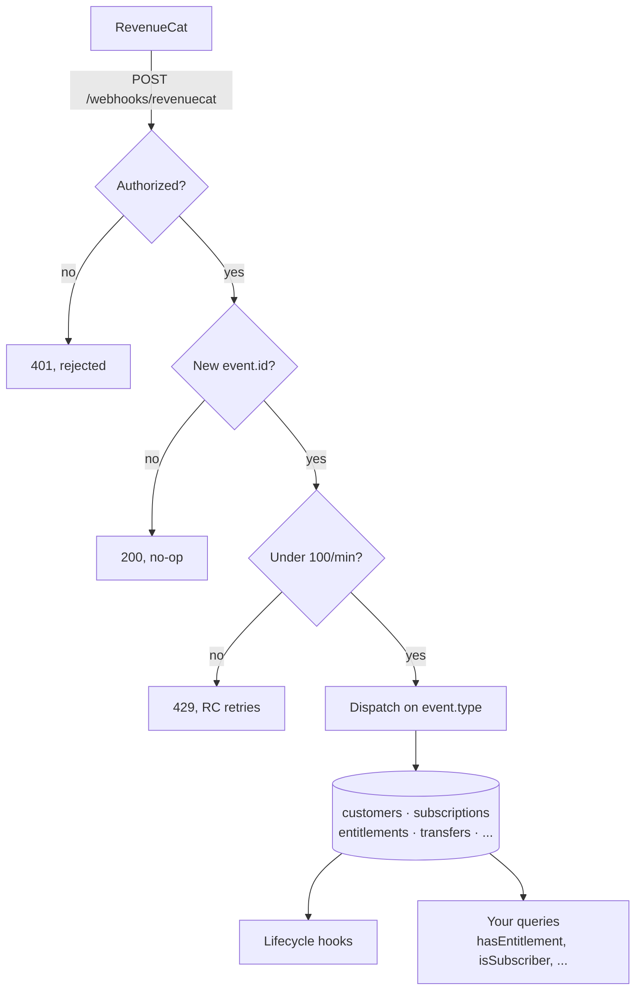
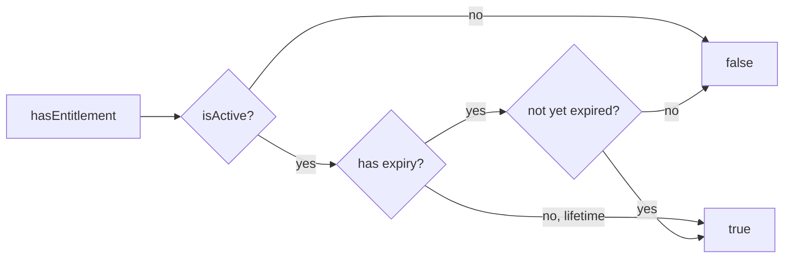

# Webhook events

[← Back to README](../README.md)

Every webhook flows through the same pipeline before it touches your tables:



RevenueCat emits 18 canonical event types. The component handles all of them
plus two legacy events (`REFUND`, `SUBSCRIBER_ALIAS`) that older projects still
receive:

| Event                          | What happens                                                                                                                                                                                                                                                                                                                                                                                                                                                 |
| :----------------------------- | :----------------------------------------------------------------------------------------------------------------------------------------------------------------------------------------------------------------------------------------------------------------------------------------------------------------------------------------------------------------------------------------------------------------------------------------------------------- |
| `INITIAL_PURCHASE`             | Creates subscription, grants entitlements                                                                                                                                                                                                                                                                                                                                                                                                                    |
| `RENEWAL`                      | Extends expiration, clears stale billing/cancel state                                                                                                                                                                                                                                                                                                                                                                                                        |
| `CANCELLATION`                 | Keeps access until expiration. Refunds are the exception: revokes immediately when `cancel_reason === "CUSTOMER_SUPPORT"` OR `price < 0` (covers Google self-serve refunds and dashboard refunds where `cancel_reason` stays `DEVELOPER_INITIATED`)                                                                                                                                                                                                          |
| `EXPIRATION`                   | Revokes entitlements                                                                                                                                                                                                                                                                                                                                                                                                                                         |
| `BILLING_ISSUE`                | Extends entitlement `expiresAtMs` to the grace period end so access continues during retry, and sets `autoRenewStatus: false` until `RENEWAL` resolves. If the issue resolves, `RENEWAL` extends further. If not, `EXPIRATION` fires at grace end and revokes. Even if `EXPIRATION` is dropped, access stops at grace end as a hard ceiling                                                                                                                  |
| `SUBSCRIPTION_PAUSED`          | Does not revoke                                                                                                                                                                                                                                                                                                                                                                                                                                              |
| `SUBSCRIPTION_EXTENDED`        | Extends expiration                                                                                                                                                                                                                                                                                                                                                                                                                                           |
| `TRANSFER`                     | Moves entitlements and subscriptions between users. When the source is a `$RCAnonymousID:` ID with no active data remaining, the source customer row and its audit trail are dropped, matching the "anonymous ID is dead after merge" semantic that iOS `DeviceCache.clearCaches` and Android `deviceCache.clearCachesForAppUserID` apply client-side                                                                                                        |
| `UNCANCELLATION`               | Clears cancellation status                                                                                                                                                                                                                                                                                                                                                                                                                                   |
| `PRODUCT_CHANGE`               | Updates product on subscription                                                                                                                                                                                                                                                                                                                                                                                                                              |
| `NON_RENEWING_PURCHASE`        | Grants entitlements for one-time purchase. Stored with `kind: "consumable"` so `getActiveSubscriptions` filters them out and `getConsumables` returns them                                                                                                                                                                                                                                                                                                   |
| `TEMPORARY_ENTITLEMENT_GRANT`  | Grants temp access during a store outage (RC caps it at 24h)                                                                                                                                                                                                                                                                                                                                                                                                 |
| `REFUND_REVERSED`              | Restores entitlements                                                                                                                                                                                                                                                                                                                                                                                                                                        |
| `TEST`                         | Logged only                                                                                                                                                                                                                                                                                                                                                                                                                                                  |
| `INVOICE_ISSUANCE`             | Invoice created (Web Billing)                                                                                                                                                                                                                                                                                                                                                                                                                                |
| `VIRTUAL_CURRENCY_TRANSACTION` | Currency adjustment                                                                                                                                                                                                                                                                                                                                                                                                                                          |
| `EXPERIMENT_ENROLLMENT`        | A/B test enrollment tracked                                                                                                                                                                                                                                                                                                                                                                                                                                  |
| `PURCHASE_REDEEMED`            | Web Billing code redemption. Ensures the `redeemed_by` customer exists. An `alias` outcome merges the original purchaser's entitlements onto the redeemer, a `transfer` defers to the companion `TRANSFER`                                                                                                                                                                                                                                                   |
| `REFUND` _(legacy)_            | Revokes entitlements. As of 2026 RC emits refunds as `CANCELLATION` with `cancel_reason: "CUSTOMER_SUPPORT"`. Handler retained for legacy projects                                                                                                                                                                                                                                                                                                           |
| `SUBSCRIBER_ALIAS` _(legacy)_  | Migrates data from anonymous to real user ID when `logIn()` is called on a previously-anonymous user. Drops the anonymous source customer row after merge. [Deprecated](https://community.revenuecat.com/sdks-51/replacement-for-subscriber-alias-event-in-webhook-1291). New projects get `TRANSFER` instead (note: `TRANSFER` also fires when `restorePurchases()` attaches an existing receipt to a new user, which is semantically different from alias) |

`CANCELLATION` does NOT revoke entitlements for normal unsubscribes. Users keep
access until `EXPIRATION`. Refunds are the exception: a `CANCELLATION` where
`cancel_reason === "CUSTOMER_SUPPORT"` OR `price < 0` revokes entitlements
immediately. `price < 0` catches Google Play self-serve refunds and
dashboard-issued refunds that leave `cancel_reason` as `DEVELOPER_INITIATED`.
Gating on `cancel_reason` alone leaks access in those cases.

A refund doesn't necessarily deactivate auto-renewal: if the subscription
auto-renews to a new period, a subsequent `RENEWAL` restores access. For extra
safety on cancellation events, callers can optionally call `syncSubscriber` to
cross-check against `GET /v1/subscribers/{app_user_id}`.

## Access-check semantics

`hasEntitlement` mirrors the iOS SDK's `EntitlementInfo.isActive`: the
entitlement's `isActive` flag and `expiresAtMs > now` (with lifetime
entitlements as the no-expiry case). Grace period is encoded into `expiresAtMs`
by the `BILLING_ISSUE` handler and `syncSubscriber`, not signaled via a separate
flag. This avoids the "indefinite access if EXPIRATION drops" bug where a
`billingIssueDetectedAt` short-circuit would keep entitlements active forever
after a failed grace period without retry.

The gate is pure expiry, with no auxiliary-flag short-circuits:



An entitlement id can be granted by more than one product (a lifetime purchase
plus a monthly sub, or the same entitlement on iOS and web). The component keeps
one entitlement row per `(appUserId, entitlementId)`, and on `EXPIRATION` or
refund it re-derives that row from the best still-active grantor instead of
revoking. The entitlement only goes inactive once every product that grants it
has expired or been refunded, matching RevenueCat's `CustomerInfo`.

## Derived `willRenew`

`Subscription.autoRenewStatus` is the iOS `EntitlementInfo.willRenew` / Android
`EntitlementInfoHelper.getWillRenew` signal, **not** the raw user-preference
toggle. It's `false` whenever any of these hold: lifetime entitlement (no
`expirationAtMs`), `periodType === "PREPAID"`, `store === "PROMOTIONAL"`,
`unsubscribeDetectedAt` set, or `billingIssueDetectedAt` set. Webhook and REST
sync paths both compute it from the same five-signal check so stored values
converge.

Consumers reading `Subscription` docs can re-derive on the client with the
`willRenew` helper:

```typescript
import { willRenew } from "convex-revenuecat";

const active = subs.filter(willRenew);
```

## Customer record

`getCustomer` returns `countryCode` (ISO 3166-1 alpha-2, mirrored from the
latest event that carried one) and `managementUrl` (RC REST
`subscriber.management_url`, the deep link to the native subscription manager:
App Store on iOS, Play Store on Android, Stripe portal on web). `managementUrl`
is populated only by `syncSubscriber`. Webhooks don't carry it. `countryCode` is
the inverse: only webhook events carry a reliable country, so `syncSubscriber`
leaves it untouched. Both are `undefined` until the first event or sync that
supplies them.

## Family sharing

`entitlements.ownershipType` is populated from the webhook `ownership_type`
field (`PURCHASED`, `FAMILY_SHARED`, or `UNKNOWN`) on every grant/extend, and
from REST sync. Consumers that want to exclude family-shared access for
single-seat products can filter:

```typescript
const active = await revenuecat.getActiveEntitlements(ctx, { appUserId });
const paidAccess = active.filter((e) => e.ownershipType !== "FAMILY_SHARED");
```

## Cross-platform coverage

Handlers accept webhook payloads from all RevenueCat stores: Apple App Store,
Mac App Store, Google Play Store, Amazon Appstore, Stripe, Paddle, Roku, Samsung
Galaxy Store, RevenueCat Web Billing, the External Purchases API, and
promotional/test grants. `store` values unknown to a given schema version
normalize to `UNKNOWN_STORE` rather than rejecting the event. Payload fields not
present in the component's validator are accepted and stored in
`webhookEvents.payload` (RC reserves the right to add fields without
versioning).

## Delivery and retries

RevenueCat delivers webhooks at-least-once with rare duplicates. The component
dedupes by `event.id` via the `webhookEvents` table.

RC's retry policy: 5 retries at 5, 10, 20, 40, and 80 minutes after first
failure. Request timeout is 60s. Only HTTP 200 counts as success. Any other code
(including 429 from the built-in rate limiter) triggers retry. After 5 failed
attempts the event is dropped.

## Sync from the REST API

Webhooks can be delayed or dropped. `syncSubscriber` pulls a subscriber's
current state from RevenueCat's API and reconciles it with the database. All
writes are idempotent, no duplicates. Call it on app foreground, after
purchases, or on a schedule.

```typescript
import { action } from "./_generated/server";
import { revenuecat } from "./revenuecat";

export const syncCurrentUser = action({
  args: {},
  handler: async (ctx) => {
    const identity = await ctx.auth.getUserIdentity();
    if (!identity) throw new Error("Not authenticated");
    const appUserId = identity.subject;
    const res = await fetch(
      `https://api.revenuecat.com/v1/subscribers/${encodeURIComponent(appUserId)}`,
      {
        headers: { Authorization: `Bearer ${process.env.REVENUECAT_API_KEY}` },
      },
    );
    if (!res.ok) throw new Error(`RevenueCat API: ${res.status}`);
    const data = await res.json();
    return await revenuecat.syncSubscriber(ctx, {
      appUserId,
      subscriber: data.subscriber,
    });
  },
});
```

<!-- prettier-ignore -->
> [!WARNING]
> This requires a **secret** API key, not the public SDK key you pass to
> `Purchases.configure`. Set it as `REVENUECAT_API_KEY` in your Convex
> environment. Using the public key will fail at runtime or grant the wrong
> permissions.
